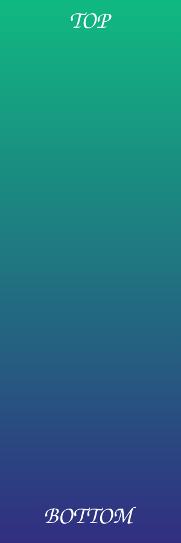
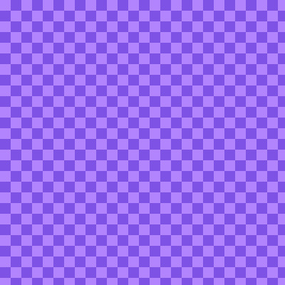

# Images

Test page for image rendering. Scroll with `j`/`k` and watch each image slide
under the top border a row at a time; resize the window to see them re-fit.

## Wide image

Should shrink to the content width and keep its 2:1 shape.

Text right after an image starts on the next row.

## Tall image

Taller than most viewports. Scroll through it: `TOP` should scroll off before
`BOTTOM` appears, with no gaps or repeated rows.

## Small image

32x32 pixels, drawn at its natural size rather than stretched to the full width.

## JPEG

## Fallbacks

These should all show alt text instead of a picture.

An image inside a sentence  stays as text.

## Inside containers

Known limitation: these draw at column 0, over the bullet and quote bar.

- A list item with an image:

  

> A quote with an image:
>
> 

---

Enough text below the last image that you can scroll it fully off the top.

line 1

line 2

line 3

line 4

line 5

line 6

line 7

line 8

line 9

line 10
